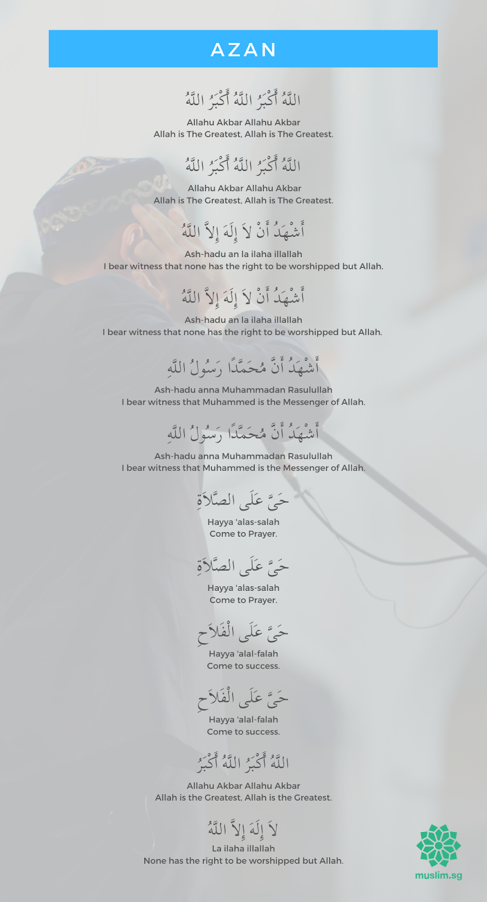

# Dua after Adhan

> ## Recitation and Translations

## `اللَّهُمَّ رَبَّ هَذِهِ الدَّعْوَةِ التَّامَّةِ وَالصَّلاَةِ الْقَائِمَةِ آتِ مُحَمَّدًا الْوَسِيلَةَ وَالْفَضِيلَةَ وَابْعَثْهُ مَقَامًا مَحْمُودًا الَّذِي وَعَدْتَهُ`

```
Allahumma Rabba hadhihid-da`watit-tammah, was-solatil qa'imah, ati Muhammadan-l-wasilata wal-fadilah, wa-b`ath-hu maqaman mahmudan-il-ladhi wa`adtahu
```

```
O Allah! Lord of this perfect call (perfect by not ascribing partners to You) and of the regular prayer which is going to be established, give Muhammad the right of intercession and illustriousness, and resurrect him to the best and the highest place in Paradise that You promised him (of)
```

> 

> ## Sources

>> [https://sunnah.com](sunnah.com)   : [Sahih al-Bukhari 614](https://sunnah.com/bukhari:614)  
>> In-book reference    :  Sahih al-Bukhari, Book 10, Hadith 12
